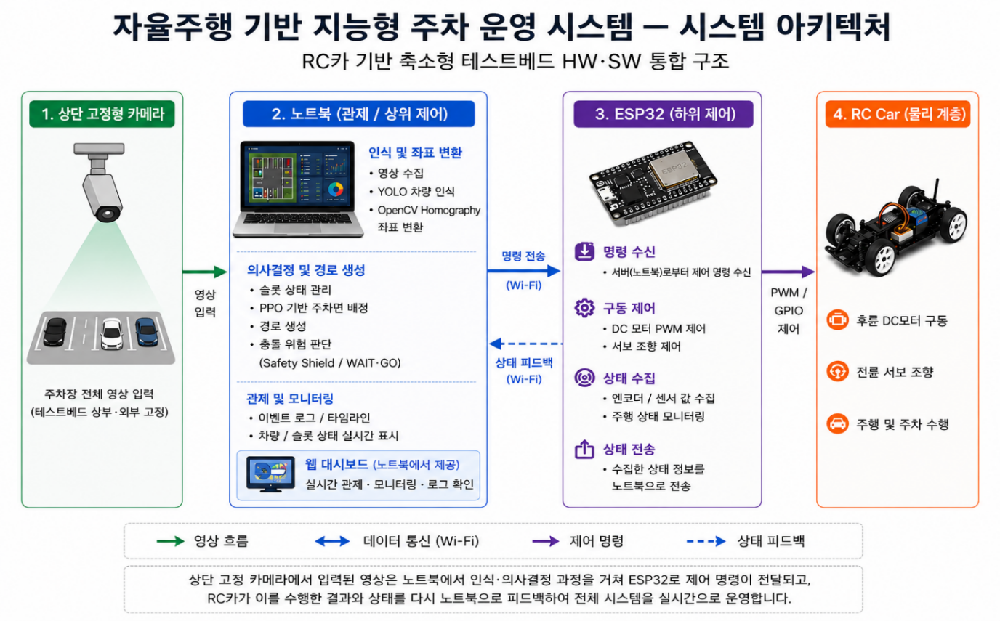

# 자율주행 기반 지능형 주차 운영 시스템 (Hanium 2026)

천장 고정 카메라 하나로 RC카의 위치·방향을 실시간 추정하고, 강화학습(PPO) 기반으로 주차면을 배정한 뒤, 노트북이 계산한 제어값을 ESP32로 보내 실제 차량을 자동주차시키는 **closed-loop perception → decision → control → feedback 시스템**입니다.

"YOLO로 차 찾고 PPO로 자리 배정한다"가 이 프로젝트의 전부가 아닙니다. 실제로 어려웠던 부분은 **인식 결과가 실제 제어 명령이 되어 물리적인 차를 움직이는 과정에서 계속 터진 문제들**이었습니다 — 조명이 바뀌면 마커를 못 찾고, 카메라가 멈춰도 차는 마지막 명령을 계속 실행하고, 시뮬레이션에서 멀쩡했던 경로가 실제 선회반경 앞에서 막혔습니다. 이 README와 `docs/`는 그 과정을 정리한 것입니다.

## Demo


실제 RC카가 배정된 슬롯(A1)으로 자동주차를 수행하는 중의 실시간 오버레이 — 인식된 heading, waypoint 단계(ALIGN/ENTRY/FINAL), 마커 신뢰도가 화면에 함께 표시된다.


웹 대시보드(`ParkView`) — 좌측 지도에 실시간 경로/슬롯 상태, 우측에 CCTV 실시간 영상과 검출 오버레이, 입출차 기록이 함께 표시된다.

> 편집된 E2E 데모 영상은 아직 없음. `backend/videos/*.MOV`(8개, 약 270MB) 원본 촬영본이 존재하나 용량이 커 저장소에 직접 포함하지 않았다 — 편집 후 외부 링크(YouTube 등) 또는 GIF로 대체 권장.

## System Architecture



카메라 → 노트북(인식/의사결정/경로생성) → ESP32(하위 제어) → RC Car로 이어지는 4단 구조와 Wi-Fi 기반 명령/피드백 흐름.

```
천장 고정 카메라
  → YOLO 2-class 검출 (rc_car, front_cushion)      cv/vehicle_detector.py
  → 차량-마커 Association                           cv/association.py
  → Heading 추정 (marker > trajectory > last_valid) cv/heading.py
  → Homography (pixel → mm 실좌표)                  cv/homography.py
  → PPO 기반 주차면 배정 (MaskablePPO)               rl/parking_env.py, rl/bridge.py
  → Waypoint 경로 생성 + 안전 검증                    parking/waypoints.py, parking/trajectory_safety.py
  → HostController 폐루프 제어                       controller/pose_controller.py, control/waypoint_controller.py
  → TCP/NDJSON 통신 (재전송/우선순위 선점)             comm/protocol.py, comm/reliability.py
  → ESP32 FreeRTOS 하위 제어 (PWM/servo/encoder)     [하드웨어 저장소] integrated/esp32_main/
  → 카메라 재관측 → 위 루프 반복 (closed loop)
  → Django Channels + Redis 실시간 상태 → React 대시보드
```

상세: [`docs/architecture.md`](docs/architecture.md)

## Key Features

- 카메라 기반 차량 위치·방향 추정 (YOLO + Homography)
- PPO 기반 동적 주차면 배정 + 규칙 기반 Safety Shield
- 실차 폐루프 주행/주차 제어 (feedforward 곡률 + feedback 오차보정)
- 통신 장애·위치 유실 시 자동 정지 (Fail-safe)
- Django Channels + Redis 기반 실시간 웹 대시보드

## My Contributions

> **TODO — 저작자 확정 전까지 임의 작성하지 않음.** git 커밋 author 이메일 확인 결과 여러 계정/이름 표기가 혼재되어 있어(`munjaehyeok`, `myyeon03@naver.com`, `jhmun <myyeon03@tukorea.ac.kr>`, 그 외 이름 불일치 커밋 2건), 어느 계정이 본인 것인지 확정한 뒤 이 섹션을 채워야 합니다. 확정되면 `git log --author=<확정된 이메일>`로 담당 모듈을 다시 추출합니다.

## Key Engineering Challenges

### 1. Perception Robustness
조명·촬영각도 변화로 전면 마커(`FRONT_CUSHION`) 검출 신뢰도가 급락해 방향 추정이 끊기고 주행이 중단되는 문제를 실측(558프레임 분석)으로 근인을 특정하고, 하드케이스 221장을 재수집해 fine-tuning으로 해결했습니다.
→ [`docs/cv-perception.md`](docs/cv-perception.md)

### 2. Vision-to-Control Integration
Detection → Association → Heading → Homography → Pose → HostController → ESP32 → Feedback으로 이어지는 경로에서, 인식 결과 하나가 흔들리면 방향이 180도 뒤집히거나 카메라가 멈춰도 차가 계속 움직이는 문제들을 stale-pose 방어와 heading 3단 폴백으로 해결했습니다.
→ [`docs/vision-to-control.md`](docs/vision-to-control.md)

### 3. Sim-to-Real Debugging
시뮬레이션/설계 단계의 가정(조향 극성, 선회반경, 통신 재연결)이 실차에서 그대로 깨진 사례들 — 조향 부호 반전, 500ms fail-safe가 발동하지 않던 stale-command 버그, 재연결 무한루프, 실측 최소 선회반경(~57cm)이 120×120cm 테스트베드와 충돌해 전진-only 경로 생성이 불가능했던 문제.
→ [`docs/sim-to-real.md`](docs/sim-to-real.md)

## Experiments & Results

- **CV**: 조명 도메인시프트 진단(Hue 177→145)과 하드케이스 재학습 — [`docs/cv-perception.md`](docs/cv-perception.md)
- **RL**: reward v1→v2, action masking, Random/Heuristic/PPO 비교(Pareto plot) — [`docs/rl-parking-assignment.md`](docs/rl-parking-assignment.md)

## Tech Stack

Python 3.12, Django 5 / DRF / Channels(Daphne), Redis, SQLite, OpenCV, Ultralytics YOLO, Gymnasium, Stable-Baselines3 + sb3-contrib(MaskablePPO), React 18 + TypeScript + Vite, ESP-IDF(C/C++), Docker/docker-compose.

## Repository Structure

이 프로젝트는 **3개의 독립된 git 저장소**로 구성됩니다.

| 저장소 | 역할 |
|---|---|
| 이 저장소 (`backend`) | Django + CV + RL + 제어 통합 서버 (핵심) |
| [`frontend`](https://github.com/hanium-2026-project/frontend) | React 대시보드 |
| 하드웨어 저장소 | ESP32 펌웨어(FreeRTOS) + HIL 테스트 브리지 |

이 저장소 내부 주요 디렉터리:

```
cv/            인식: YOLO 검출, association, heading, homography
rl/            PPO 주차면 배정: env, reward, train, inference
parking/       Django 앱: 모델/API/waypoint/safety
controller/    좌표/조향 계산 (pure geometry)
control/       waypoint 추종 제어기
host_control/  제어 권한 상태기계, approach/final pose guard
comm/          ESP32 통신 프로토콜, 신뢰성 전송
integration/   CV/RL/제어를 파이프라인으로 엮는 adapter
pipeline/      실제 end-to-end 실행 진입점 (run_pipeline)
docs/          상세 기술 문서 (이 README가 링크)
```

## How to Run

```bash
cp .env.example .env
docker compose up --build
```

- Backend (Daphne ASGI): http://localhost:8000
- Redis: localhost:6379

실차 자동주차 파이프라인 실행 (production 경로는 `auto-host` 명시 필요):

```bash
python manage.py run_pipeline --control-mode auto-host --calibration calibration.json --weights <best.pt> --show
```

자세한 명령/트러블슈팅은 저장소 내 기존 안내를 참고하세요 (`docker compose exec backend ...`, Common commands는 이전 README 버전 참고).

## Lessons Learned

- 각 모듈(인식/좌표변환/경로생성/제어/통신/액추에이터)이 단독으로는 정상 동작해도, 실제 E2E에서는 pose 지연·heading 오차·waypoint 지나침·통신 상태·차량의 물리적 선회 한계가 동시에 얽혀 예상 못한 실패가 발생했습니다. 인터페이스와 상태전이까지 포함한 통합 검증이 기능 구현보다 중요했습니다.
- 시뮬레이션이나 코드만으로는 예측하기 어려운 물리적 요소(모터 정지마찰, 조향 부하, 최소 선회반경, 카메라 인식 지연)가 실제 성능을 좌우했습니다 — 계측하고 제어에 반영하는 과정이 필수적이었습니다.
- 디버깅 중 여러 변수를 동시에 바꾸면 원인 추적이 어려워졌습니다. 정상 동작하던 baseline을 보존하고 한 번에 하나씩 바꾸는 방식이 훨씬 효과적이었습니다.

## Detailed Documentation

- [`docs/architecture.md`](docs/architecture.md) — 전체 시스템 구조, 3-repo 관계
- [`docs/cv-perception.md`](docs/cv-perception.md) — YOLO 인식, 조명 도메인시프트, fine-tuning
- [`docs/vision-to-control.md`](docs/vision-to-control.md) — Detection→Control 파이프라인, stale-pose 방어
- [`docs/sim-to-real.md`](docs/sim-to-real.md) — 실차에서 발견된 시뮬레이션-실제 격차
- [`docs/rl-parking-assignment.md`](docs/rl-parking-assignment.md) — PPO 주차면 배정, reward 설계
- [`docs/system-integration.md`](docs/system-integration.md) — Django/Redis/통신/배포
