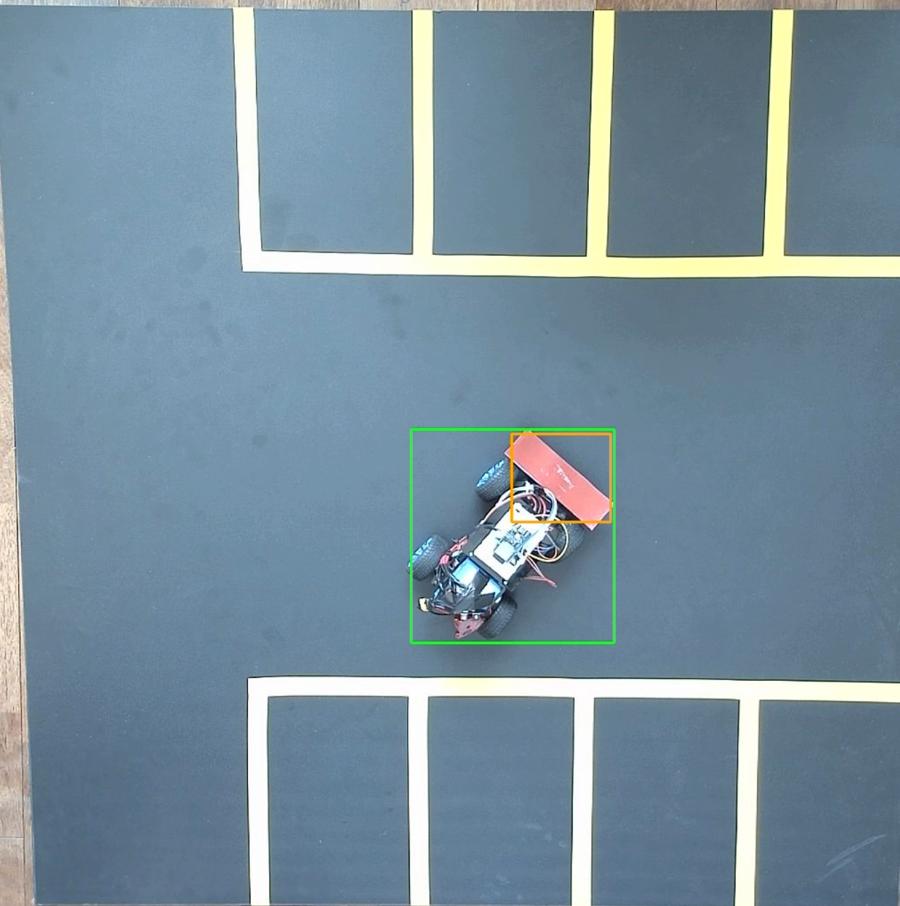
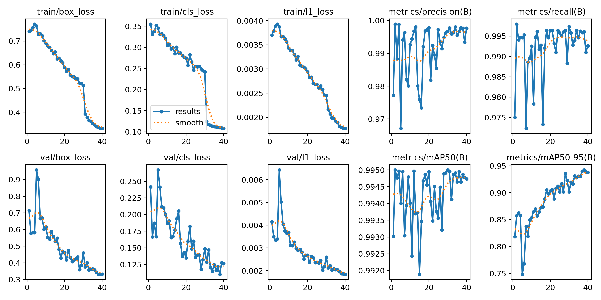
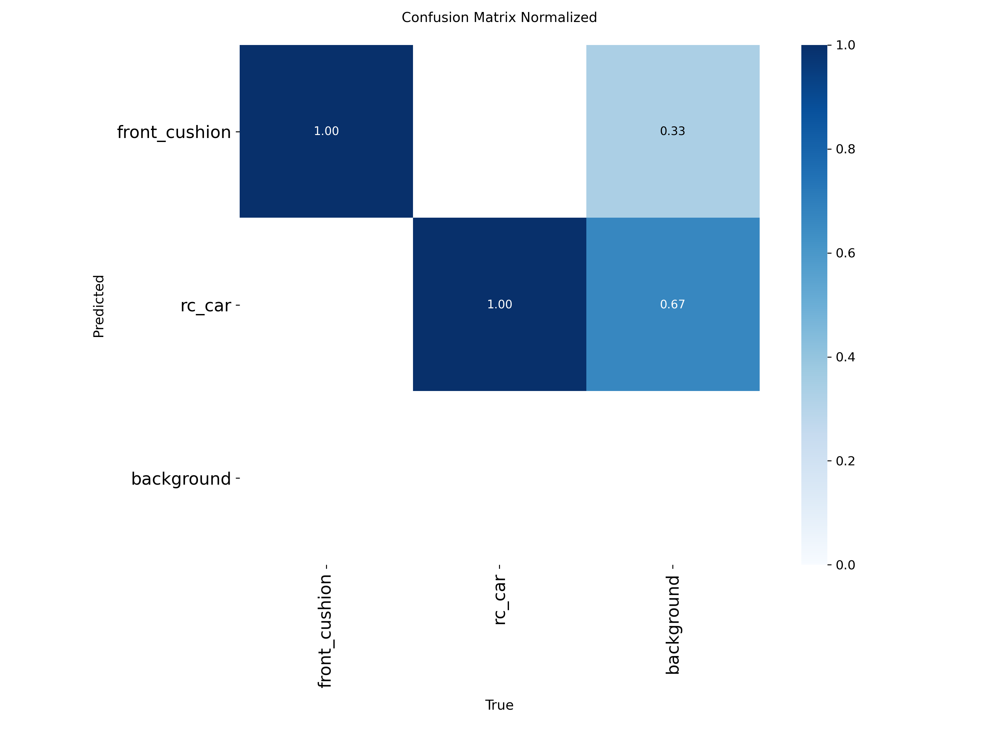

# CV / Perception: 조명 도메인시프트와 Fine-tuning

## Problem

주간에 안정적으로 동작하던 전면 마커(`front_cushion`) 검출이 야간 실내조명 환경에서 급격히 저하되었다. 실차 영상 558프레임을 분석한 결과 129프레임(23%)에서 검출 신뢰도가 운영 임계값(0.4)에 미달했고, 방향 추정이 과거값(`LAST_VALID`)으로 대체되며 주행이 중단되는 현상이 발생했다.

## Observation

- 정면으로 마커가 노출될 때 신뢰도 0.92, 측면으로 노출될 때 0.05~0.18 — 촬영 각도(실루엣 변화)에 따라 신뢰도가 크게 흔들렸다.
- 초기 마커(흰색 폼)는 햇빛 반사가 있는 구간에서 오검출(신뢰도 0.62)이 발생했다.
- 차량 본체(`rc_car`) 클래스의 검출 신뢰도는 야간에도 0.891로 정상이었다 — 문제가 마커 클래스에 국한된 것을 확인.

천장 카메라 프레임에서 `rc_car`(녹색)와 `front_cushion`(주황) 박스가 함께 검출된 실제 예시.

## Root Cause

원인은 "조명이 어두워서 안 보인다"가 아니라, **조명 색온도 변화로 마커의 색상 자체가 이동한 것**이었다.

- 주간: Hue ≈ 177(적색), 명도 232
- 야간: Hue ≈ 145(자홍), 명도 149

밝은 적색만 학습한 모델이 색이 이동한(어두운 자홍 영역) 같은 물체를 인식하지 못하는 **도메인 시프트**였다. 색 기반 검출 로직(`tools/preannotate.py` 등)도 기존 Hue 범위를 벗어난 값을 걸러내지 못해 해당 조명 영상에서 자동 라벨링 성공률이 0%까지 떨어졌다.

## Experiment / Solution

1. 마커를 흰색 폼 → 적색 플레이트로 물리적으로 교체 (반사 오검출 문제 완화).
2. 실패 프레임 129장 전량 + 성공 프레임 표본을 포함한 하드케이스 **221장**을 구성.
3. 기존 가중치에서 이어 학습(fine-tune)하여 색상 이동을 모델이 흡수하도록 함.
4. 색 기반 후보 검출 로직의 HSV 범위를 확장하고, 다중 후보가 있을 때 차체에 인접한 후보를 선택하도록 보완 — 커밋 `ce76c42` ("색 기반 마커 검출을 조명 변화와 다중 후보에 견디게 수정").

## Result

- 자동 라벨링 성공률: 0% → 100%(221 프레임, 442 boxes) — 커밋 `ce76c42`에서 직접 확인된 수치.
- 별도의 외부 YOLO fine-tuning 실행(`runs/detect/rc_car_marker_v3`, Colab, `best0824.pt`에서 resume)에서 확인된 within-run 지표(최종 epoch 40): Precision 0.9977, Recall 0.9926, mAP50 0.9947, mAP50-95 0.938 (epoch 1: mAP50-95 0.819).

이 fine-tuning 실행의 epoch별 loss/precision/recall/mAP 곡선 (40 epoch, `best0824.pt`에서 resume).

최종 epoch 기준 정규화 confusion matrix — `rc_car`/`front_cushion`/background 간 오분류가 거의 없음을 보여준다.

> **주의 — 재학습 이전 모델과의 비교는 제공하지 않음.** `best0824.pt`(이 fine-tune의 시작 체크포인트) 자체의 독립적인 평가 지표 파일이 존재하지 않아, "재학습 전/후 몇 % 향상"이라는 비교는 근거가 없다. 위에 제시한 수치는 이 fine-tuning 실행 **내부의 epoch 진행**만을 보여준다.

## System Impact

- `cv/heading.py`의 `HeadingEstimator`가 마커 검출 실패를 3단 폴백(marker → trajectory → last_valid)으로 흡수하도록 설계되어 있어, 이번 문제가 재발해도 시스템이 완전히 멈추지 않고 성능이 저하되는 방식으로 동작한다 (자세한 내용은 [`vision-to-control.md`](vision-to-control.md)).
- 데이터셋(`data/baseline_20260823`, `data/red_marker_20260823`, `data/evening_20260831` 등)은 용량 문제로 git에 커밋하지 않고(`.gitignore`) 로컬/Roboflow에만 보관한다.

## 참고

- `plate_detector.py`는 학습된 모델이 아니라 **결정론적 MVP 스텁**(Protocol 인터페이스 뒤의 placeholder)이다. 이 프로젝트의 CV 성과로 서술하지 않는다.

