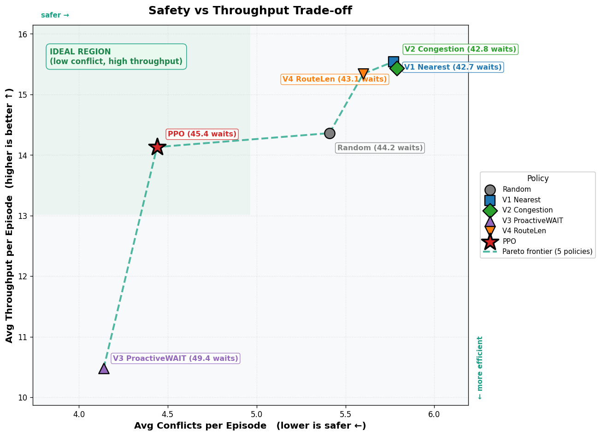
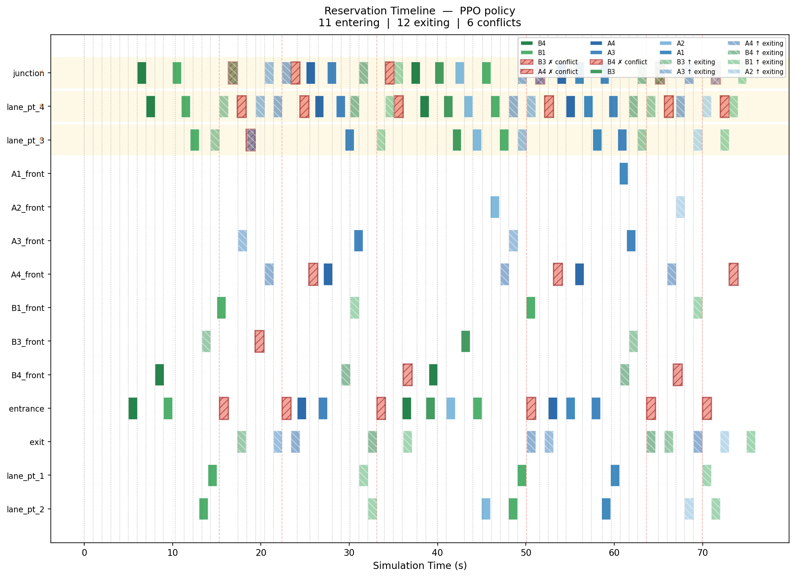

# RL 기반 주차면 배정 (MaskablePPO)

## 환경 설계

`rl/parking_env.py`는 Gymnasium 스타일 환경으로 세 레이어를 갖는다: RL 배정(`step`/`action_masks`), 교통 시뮬레이터(차량 이동 보간), 출차 처리. 관측(`_get_obs`)은 21차원 벡터다:

- `[0:8]` 슬롯 점유 상태 (8개 슬롯)
- `[8:17]` 진입 차량 3대 × (현재, 다음, ETA) 특징
- `[17:20]` 병목 노드 예약 밀도
- `[20]` 입차 간격(IAT)

행동 공간은 `Discrete(9)` — 슬롯 8개 + WAIT.

## Action Masking

`action_masks()`가 MaskablePPO에 이번 스텝에서 선택 가능한 행동만 남긴다: 이미 점유되거나 예약 충돌이 있는 슬롯, 그리고 WAIT를 남용하는 경우(연속 WAIT 한도)를 사전에 제거한다. 모든 슬롯이 막히면 다음 출차 이벤트까지 시간을 fast-forward한다. 불가능한 행동을 정책 탐색 공간에서 미리 제거해 학습 안정성과 탐색 효율을 높인다.

## Safety Shield

`_check_conflict()`는 경로 노드별 (진입, 이탈) 시각 구간이 겹치면 충돌로 판정한다. **이 검사는 RL 정책과 독립적으로 동작한다** — 정책이 어떤 슬롯을 선택하든, 경로가 충돌하면 예약/차량 생성이 실행되지 않는다. RL이 실수해도 실제 운영 안전은 이 Shield가 보장하는 구조다.

## Reward 설계: v1 → v2

`rl/reward.py`의 `compute_reward()`가 반환하는 보상은 슬롯 배정 1건에 대한 스칼라 값이다: 충돌이면 즉시 `CONFLICT_PENALTY`, 아니면 효율/혼잡/흐름 보상의 합.

- **v1**: `CONFLICT_PENALTY = -10`. 학습 결과 PPO가 "충돌회피 전문가"가 되어 처리량(throughput)을 희생시키는 문제가 관측됐다.
- **v2**: `CONFLICT_PENALTY = -5`로 낮추고, 흐름 보상 `R_flow`(슬롯 재사용 + 빈 슬롯 분산 보너스, 가중치 δ=0.8)를 추가. 이 변경 이유는 `reward.py` docstring에 직접 문서화되어 있다.

## WAIT Penalty Sweep

`rl/sweep_wait_penalty.py`로 `WAIT_PENALTY_BASE` ∈ {-0.2, -1, -2, -3}를 스윕했다. `-0.2`에서는 WAIT를 선택할 유인이 너무 작아 처리량이 붕괴하는 현상이 관측됐고, 그 산술적 이유가 스크립트 docstring에 정리되어 있다.

## Random / Heuristic / PPO 비교

`rl/plot_pareto.py` / `rl/visualize.py`가 random, heuristic v1~v4, PPO 정책을 avg-conflicts(x) vs avg-throughput(y) Pareto plot으로 비교한다 (`outputs/pareto_safety_throughput.png`, `outputs/ppo_timeline.png`, `outputs/heuristic_timeline.png`, `outputs/random_timeline.png`).

avg-conflicts(x) vs avg-throughput(y) — random, heuristic v1~v4, PPO 정책의 위치를 비교한 Pareto plot. PPO가 낮은 충돌·높은 처리량 쪽에 위치한다.

PPO 정책으로 시뮬레이션을 실행했을 때의 슬롯 점유/입출차 timeline.

## 실제 시스템에서의 위치 — 한계를 숨기지 않음

학습된 정책(`models/sb3_parking_policy.zip`)은 시뮬레이션 전용이 아니다 — `pipeline/runner.py`가 `rl.bridge.RealtimeAllocator`를 직접 import하고, `pipeline/config.py`의 기본 `policy_path`가 이 zip을 가리킨다.

다만 다음 두 가지는 명확히 밝혀야 한다:

1. **`requirements-ml.txt`(stable-baselines3, sb3-contrib)는 배포용 `Dockerfile`에 설치되지 않는다.** 배포 이미지에서는 `rl/inference.py`의 heuristic fallback 정책이 실행되며, 학습된 PPO 정책은 학습/개발 환경에서만 로드된다.
2. **실차 운용에서는 규칙 기반(rule-based) 배정 방식도 병행했다.** 개발보고서에 팀이 직접 명시한 바("강화학습 환경과 정책은 시뮬레이션으로 검증하였으며, 실차 운용에서는 안정적인 동작을 위해 규칙 기반 배정 방식도 병행하였다") — RL 정책이 실차 전체를 단독으로 제어했다고 서술하지 않는다.

## System Impact

RL 배정 결과는 [`architecture.md`](architecture.md)의 흐름에서 waypoint 생성 직전 단계에 위치한다. 배정된 슬롯이 실제로 안전하게 도달 가능한지는 Safety Shield와 [`vision-to-control.md`](vision-to-control.md)의 pose/제어 레이어가 이어서 검증한다.

