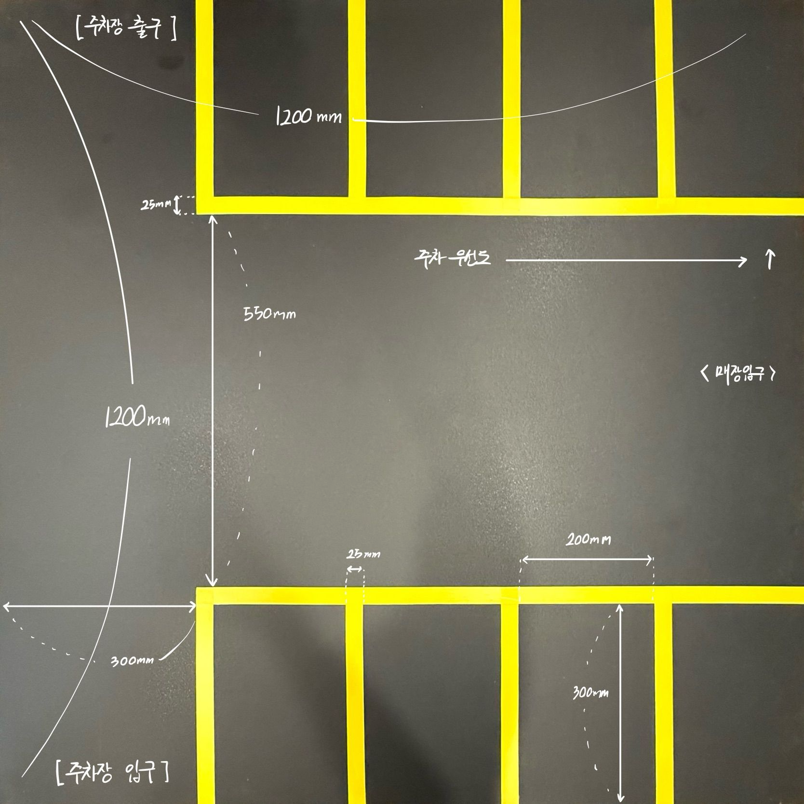
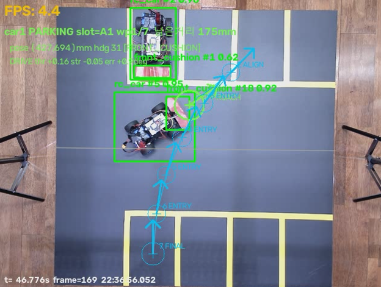

# Sim-to-Real Debugging

시뮬레이션·설계 단계에서의 가정과 실제 RC카/네트워크/기구의 동작 사이에는 계속 격차가 있었다. **"모델/시뮬레이션 성능이 높다"는 "실제 시스템이 잘 동작한다"와 같은 말이 아니었다** — 이 문서는 그 격차가 구체적으로 어떻게 드러났고, 어떻게 계측하고 고쳤는지를 정리한다.

## 1. 조향 극성(Steering Polarity)이 반대였다

펌웨어의 조향 배선 극성이 애초에 가정한 방향과 반대였다. 실차 시험에서 이를 발견하고 `steering_sign`을 `-1.0`으로 확정했다 (커밋 `d5e4638`). 시뮬레이션이나 코드 리뷰만으로는 드러나지 않는, 물리적 배선 자체의 문제였다.

## 2. Stale Pose에도 계속 나가던 마지막 명령

카메라 pose가 멈췄을 때, 서버가 마지막 non-zero 명령을 계속 재전송하고 있어서 ESP32의 500ms fail-safe watchdog가 "패킷이 계속 들어온다"는 이유로 발동하지 않았다. `control_stale_ms=300ms`를 기준으로 오래된 제어값을 강제로 0으로 만드는 로직을 추가해 해결했다 (커밋 `d5e4638`, 상세 메커니즘은 [`vision-to-control.md`](vision-to-control.md) §5).

## 3. NO_HEADING → FAULTED 데드락

heading 추정기는 차량이 움직여야 방향을 알 수 있는데, `NO_HEADING` 상태를 즉시 `FAULTED`로 래치해버리면 차량이 **영원히 출발할 수 없는** 상태에 빠졌다. `WARMUP` 상태를 추가하고, 이미 목표에 도착했지만 heading을 모르는 경우를 위해 도착 판정을 heading 게이트보다 먼저 검사하도록 순서를 바꿔 데드락을 없앴다 (커밋 `d5e4638`).

## 4. 재연결 무한루프

통신이 한 번 끊기면 펌웨어가 `EMERGENCY_STOP`으로 전환된다. 재연결 시 클라이언트가 "이전 상태가 `EMERGENCY_STOP`이었다"는 이유로 세션을 보류(hold)했는데, 보류 상태에서는 `HEARTBEAT`도 막혀서 1초 후 다시 `COMM_TIMEOUT`이 발생하고 — 이 사이클이 무한히 반복됐다. `EMERGENCY_STOP` 이력만으로는 보류하지 않고, HOLD 중에도 heartbeat는 계속 보내도록 수정했다 (커밋 `84faa33`, "실차에서 찾은 복구 불가 고리").

## 5. 실측 최소 선회반경 ≈ 57cm vs 120×120cm 테스트베드

서보 throw를 11% 넓혔음에도(46~126°) 실제 앞바퀴 조향각은 bicycle model로 역산했을 때 14~17°에 그쳤다 — 즉 소프트웨어 조향각 명령이 실제 바퀴 각도로 거의 전달되지 않는 구간이 있었다. 이 결과로 계산된 최소 선회반경(≈57cm, 선회 지름 ≈114cm)은 120×120cm 테스트베드와 거의 같은 크기였다. **전진만으로는 모든 주차 자세를 만들 수 없다는 것이 실측으로 확인됐고**, 이는 소프트웨어 튜닝이 아니라 **조향 링키지 기구 자체의 한계**로 특정됐다 (`docs/hw_team_handoff_2026-08-07.md` + 2026-08-11 실측 보강).

이 발견은 아키텍처 결정으로 이어졌다: 경로 계획(planner)과 recovery/parking 로직에 **전진뿐 아니라 후진 기동**을 도입해야 했다.

실제 1200×1200mm 테스트베드의 슬롯/도로 치수 실측 — 선회반경 문제가 왜 맵 전체 크기와 충돌하는지의 근거가 되는 물리적 공간이다.

## 6. Waypoint 지나침(overshoot)과 재계획

정확한 waypoint 재획득을 요구하면, 차량 관성 때문에 지나친 지점을 다시 추종하려다 큰 원을 그리며 도는 현상이 발생했다. COARSE/FINE capture 반경, pass-line 판정, progress 기반 miss 판정을 도입해 지나친 것을 감지하고 즉시 재계획(replanning)하도록 했다 (`host_control/approach_guard.py`).

실제 주차 실행 중 화면 — 배정된 슬롯(A1), ALIGN/ENTRY/FINAL 단계별 waypoint, 마커 신뢰도(예: cushion #1 0.62, #18 0.92)가 함께 표시된다. FPS 표시가 낮게 찍힌 프레임도 있어, 인식 주기 자체가 제어 루프의 실질적 제약이 될 수 있음을 보여준다.

실제 핸드오프 로그에도 이 두 케이스가 남아 있다: `logs/handoff_20260811/case_A_success_10hz.csv`(33.0cm → 9.8cm로 성공 수렴)와 `case_B_overshoot_0p5s.csv`(overshoot 케이스). 두 로그는 좌표/시간 시계열 CSV만 존재하며, 궤적을 시각화한 플롯 이미지는 아직 없다.

## 7. PWM Dead Zone / 강한 조향 시 throttle 무시

펌웨어의 `throttle_to_duty()`는 `|steering| > 0.5`일 때 throttle 값을 무시하고 고정 duty로 강회전을 처리한다. 이는 `run_pipeline.py`의 turn-slowdown 로직(계획 단계에서 회전 중 속도를 낮추려는 의도)이 실제로는 적용되지 않는다는 뜻이다 — 소프트웨어와 펌웨어 사이의 설계 충돌로, 문서에는 옵션 A/B가 제시되어 있으나 이번 조사 시점까지 해결 여부는 확인되지 않았다(TODO 확인 필요).

## System Impact — 무엇을 배웠는가

- 시뮬레이션에서 생성한 경로를 그대로 적용하지 않고, 실제 RC카의 최소 선회반경·조향 부하·저속 구동 특성·정지거리를 반복 측정해 경로 생성과 제어에 반영해야 했다.
- **실차 E2E 성공은 확보했지만, 동일 조건에서 항상 같은 결과를 보장하는 수준의 반복 안정화에는 도달하지 못했다.** 주요 원인은 카메라 위치/방향 정보의 순간적 오차, 차량별 선회반경·정지거리 차이, 저속 구간 구동 편차가 복합적으로 작용하기 때문으로 판단된다 — 이는 팀이 개발보고서에 직접 명시한 한계이며, 여기서도 과장하지 않는다.
- 디버깅 중 여러 변수를 동시에 바꾸면 원인과 회귀 지점을 추적하기 어려웠다. 정상 동작하던 baseline을 checkpoint로 보존하고, 한 번에 하나의 변수만 바꿔 이전 run과 비교하는 방식이 훨씬 효과적이었다.

- 선회반경 실측 다이어그램(서보각 vs 실제 바퀴각)
