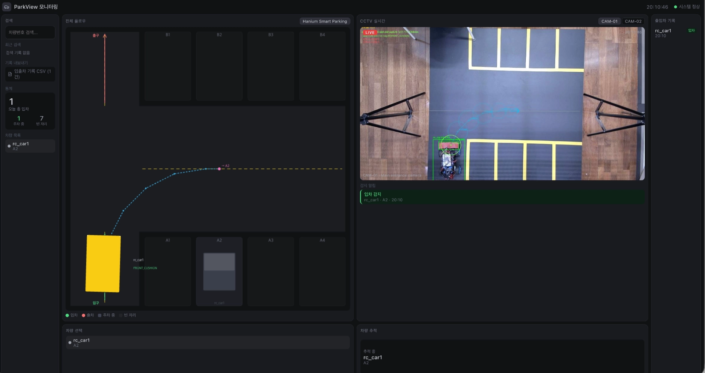

# System Integration

이 문서는 CV/RL/제어가 아니라, 그것들을 실제로 하나의 실행 가능한 시스템으로 엮는 웹/통신/배포 레이어를 다룬다. Perception→Control 자체의 문제 해결 과정은 [`vision-to-control.md`](vision-to-control.md)와 [`sim-to-real.md`](sim-to-real.md)에서 다뤘으므로 여기서는 반복하지 않는다.

## 데이터 모델 & API (Django)

`parking/models.py`는 `Vehicle`, `ParkingLot`, `ParkingSpot`, `Camera`, `EntryExit`, `RoutePlan`, `SensorEvent`, `ParkingAssignment`, `RLPolicyLog`, `CameraFrameLog`를 정의한다 — RL/CV 이벤트도 런타임 상태로만 존재하는 게 아니라 DB 로그 테이블로 남는다.

REST 표면(`parking/urls.py`): `vehicles`, `parking-lots`, `parking-spots`, `cameras`, `transactions`, `routes` 리소스와 `entry/`, `exit/`, `recommendations/spots/`, `dashboard/`, `cameras/<id>/stream/`(MJPEG 릴레이). WebSocket은 `ws/dashboard/` 하나로, `DashboardConsumer`(Channels `AsyncWebsocketConsumer`)가 처리한다.

## 실시간 상태 전파 (Channels + Redis)

`config/settings.py`의 `CHANNEL_LAYERS`는 `REDIS_URL`이 설정되어 있으면 Redis 기반, 없으면 `InMemoryChannelLayer`로 전환된다. **이 fallback은 조용히 일어난다** — 파이프라인 프로세스와 웹 프로세스가 분리된 배포에서 Redis가 빠지면 두 프로세스 간 브로드캐스트가 안 되는데, 에러 없이 그냥 조용히 멈춘다. 배포 체크리스트에 `REDIS_URL` 확인을 명시해야 하는 이유다.

MJPEG 스트리밍(`cameras/<id>/stream/`)은 한 번 실제 버그를 겪었다: Django ASGI가 동기 제너레이터를 끝까지 소비한 뒤에야 응답하기 때문에, 무한 스트림인 MJPEG는 첫 프레임조차 전송되지 않았다. 스트림 생성부를 비동기 제너레이터로 전환해 프레임 단위 전송이 가능해졌다.

## CV/RL/제어를 파이프라인으로 엮는 통합 레이어

`integration/` 패키지가 각 서브시스템을 실제 실행 흐름으로 연결한다.

- `camera_adapter.py`: pose timestamp를 새 관측이 있을 때만 갱신 ([`vision-to-control.md`](vision-to-control.md) §4 참조).
- `control_scheduler.py`: 카메라 콜백과 독립된 100ms tick 루프 ([`vision-to-control.md`](vision-to-control.md) §5 참조).
- `remote_direct_session.py`: `SET_MODE`/`ACCEPTED` 핸드셰이크, 다중 차량 fan-out — `direct_control_enabled`가 서버 전역 플래그이므로 한 차량의 fault가 다른 차량의 제어 스트림을 죽이지 않도록 설계됐다.
- `backend_adapter.py`는 실제 프로덕션 배선이 아니라 **예시/참조 코드**다 — README/문서에서 실제 코드처럼 인용하지 않는다.

`pipeline/runner.py`(management command `run_pipeline`)가 실제 end-to-end 진입점이다: 카메라 → YOLO(`--weights`) → RL 슬롯 배정 → 컨트롤러 → `VehicleServer`(TCP) → (옵션) Redis frame publish → 대시보드 WS. CLI 플래그 기본값이 실측 기반인 것이 특징이다: `--steering-sign`(실차 확인값 -1), `--turn-radius`(61cm, 실측), `--strong-turn-throttle`(0.70, 그 이하는 펌웨어 PWM duty가 38~40에 고정되어 못 움직임), `--parking-mode rear`(auto-host 모드에서만, "현재 B1 슬롯만 검증"이라는 주석 포함).

## 통신 프로토콜

`comm/protocol.py`는 버전이 있는 NDJSON(≤512B) 프로토콜로, seq 기반 재확인·재전송이 필요한 `RELIABLE_TYPES`와, 최신 값만 의미 있는 스트리밍 타입(`POSE_UPDATE`, `DIRECT_CONTROL`, `HEARTBEAT`)을 구분한다. `PREEMPTIVE_TYPES`는 STOP > WAIT > 일반 순으로 우선순위를 정의한다. 신뢰성 전송(`comm/reliability.py`)은 [`vision-to-control.md`](vision-to-control.md) §7에서 다뤘다.

## 배포

`docker-compose.yml`이 `redis` + `backend`(Daphne ASGI, 8000번) + `frontend`(Vite, 5173번)를 묶는다. `backend/Dockerfile`은 `requirements.txt`(Django/Channels/opencv-headless/ultralytics/gymnasium)만 설치하고, **`requirements-ml.txt`(stable-baselines3, ray)는 배포 이미지에 포함되지 않는다** — 이 gap의 시스템적 의미는 [`rl-parking-assignment.md`](rl-parking-assignment.md)에서 다뤘다.

## Frontend 대시보드

`frontend`는 원래 여러 페이지(Vehicles/ParkingMap/Route/Simulation)로 구성됐다가, CV 트래킹과 무관한 페이지들을 제거하고 **단일 `DashboardPage`**로 의도적으로 축소했다(`App.tsx` 주석에 명시). `DashboardPage`는 REST(`src/api/parking.ts`)와 WebSocket(`VITE_WS_URL`)을 함께 사용해 CCTV 피드, 주차장 지도, 차량/이벤트 목록을 그린다.

stale 상태를 숨기지 않고 보여주는 것도 설계 결정이다: `POSE_STALE_MS=2500`, `POSE_DROP_MS=15000` 상수와 함께 "파이프라인이 죽었는데 차량이 마지막 위치에 그대로 떠 있으면 데모 중 오판을 유발할 수 있다"는 주석이 있다. `WS_RECONNECT_MS=2000`으로 백엔드 재시작 후 자동 재연결한다.

`DashboardPage`의 실제 화면 — 좌측 지도(경로/슬롯 상태), 우측 CCTV 실시간 영상과 검출 오버레이, 입출차 기록이 한 화면에 통합되어 있다.
